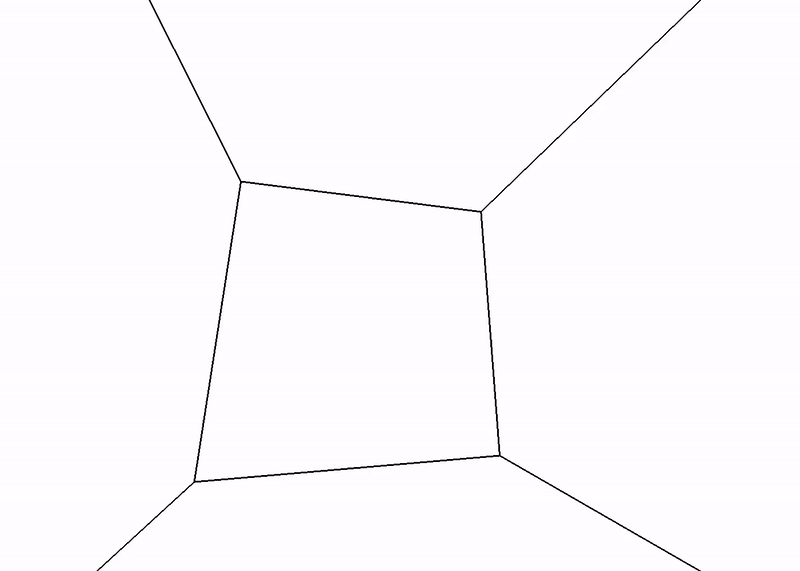

# Boid Simulation
A Boid Simulation is an modeled aproximation of the behavior of a flock of birds according to the rules of separation, cohesion and alignment.  

    Separation: Boids try to avoid crowding.
    Cohesion: Boids steer toward the average position of the flock.
    Alignment: Boids steer towards the average headding of the flock.

This simulated life program is an example of swarm intelligence that does not require complex programming or a form of central commanding unit.
In this implementation we use opengl to render a configurable simulation of bird-oid objects.

# Usage
A simulation can be started by calling the class ``Simulation`` directly, or by using the ``BoidSimulationController`` like in main.py to use a gui. 

# Demo
